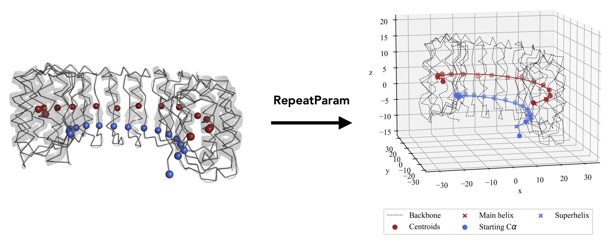

# RepeatParam: Repeat Protein Parameterisation

Python alogrithm to parameterise a repeat protein and get all the parameters of the helix that describes the protein

To run the test program:
python run.py 3ugm ./test_data/pdb3ugm.ent A 196 1034 32 --Ca 217 196 254 287 323 425 459 357 493 527 560 594 391 696 628 730 764 833 798 866 934 1002 968 662 900 --insert

